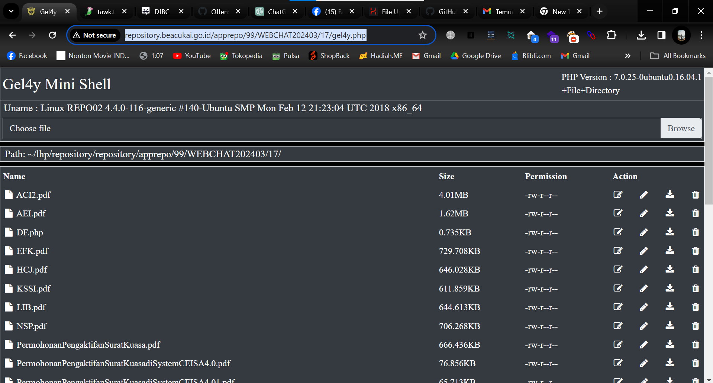
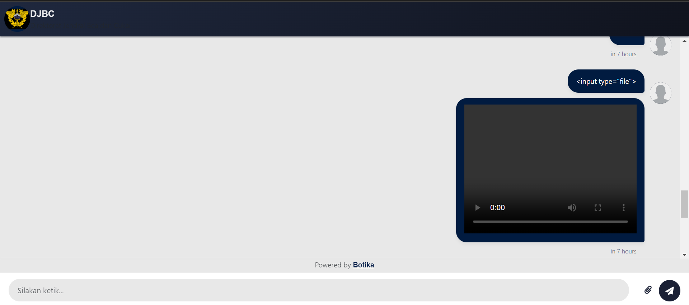

# Vulnerability Discovery: Backdoor File Upload & HTML Injection at livechat.beacukai.go.id

This repository documents the discovery of two critical vulnerabilities on the **[https://livechat.beacukai.go.id/](https://livechat.beacukai.go.id/)** website (now offline):

1. **Backdoor File Upload** vulnerability.
2. **HTML Injection** vulnerability.

## Tools Used:

* **Manual Exploitation**: Identified vulnerabilities by interacting directly with the web interface.
* **Web Browser**: Used for injecting and exploiting the vulnerabilities.

## Vulnerabilities Found:

### 1. **Backdoor File Upload**:

The **Backdoor File Upload** vulnerability was discovered on the **livechat.beacukai.go.id** website. The site allowed users to upload files without properly validating them, making it possible to upload malicious files such as a PHP backdoor.

#### Example Payload:

A PHP web shell file (e.g., `backdoor.php`) was uploaded through the file upload feature, granting access to the server.

#### Screenshot of Backdoor Upload:



### 2. **HTML Injection**:

An **HTML Injection** vulnerability was identified in the input fields, which allowed the injection of arbitrary HTML tags and JavaScript code.

#### Example Payload:

```html
<script>alert('HTML Injection Vulnerability');</script>
```

### Exploit:

By injecting HTML or JavaScript code, attackers could manipulate the behavior of the web page or execute arbitrary actions, such as alert pop-ups or other malicious interactions.

#### Screenshot of Exploit:



## Steps to Reproduce:

### For Backdoor File Upload:

1. Access the file upload feature on **[https://livechat.beacukai.go.id/](https://livechat.beacukai.go.id/)**.
2. Upload a malicious PHP file (e.g., `backdoor.php`).
3. Once uploaded, access the file directly via the URL and gain remote access to the server.

### For HTML Injection:

1. Navigate to any input field on the page (e.g., message box).
2. Inject the HTML payload, such as the one provided above.
3. The injected script will execute upon submission, demonstrating the vulnerability.

## Mitigation Recommendations:

### For Backdoor File Upload:

* Validate and sanitize all uploaded files.
* Restrict file types that can be uploaded, allowing only safe file extensions like `.jpg`, `.png`, `.pdf`, etc.
* Store uploaded files outside the web root to prevent execution.

### For HTML Injection:

* Implement **input sanitization** and **output encoding** to prevent the injection of arbitrary HTML and JavaScript.
* Use a **Content Security Policy (CSP)** to mitigate the execution of unauthorized scripts.

## License:

This project is intended for **educational purposes** and **ethical hacking** only. Always ensure that any security testing is conducted responsibly and with proper authorization from relevant authorities.

